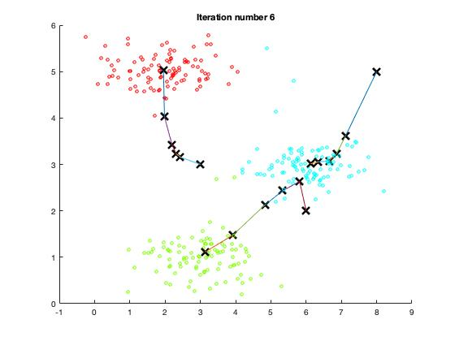

# Machine Learning (MATLAB) - *K*-Means Clustering and Principle Component Analysis

Machine Learning course from Stanford University on [Coursera](https://www.coursera.org/learn/machine-learning/home/week/8).

### Introduction
We will implement the K-means clustering algorithm and apply it to compress an image. And will use principal component analysis to find a low-dimensional representation of face images.

### Environment
- macOS Catalina (version 10.15.3)
- MATLAB 2018 b

### Dataset
- ex7data1.mat
- ex7data2.mat
- ex7faces.mat

### Files included in this repo
- ex7.m - Octave/MATLAB script for the K-means clustering 
- ex7_pca.m - Octave/MATLAB script for PCA 
- ex7data1.mat - Example Dataset for PCA
- ex7data2.mat - Example Dataset for K-means
- ex7faces.mat - Faces Dataset
- bird_small.png - Example Image
- displayData.m - Displays 2D data stored in a matrix
- drawLine.m - Draws a line over an exsiting figure 
- plotDataPoints.m - Initialization for K-means centroids 
- plotProgresskMeans.m - Plots each step of K-means as it proceeds
- runkMeans.m - Runs the K-means algorithm
- submit.m - Submission script that sends our solutions to the servers 

[⋆] pca.m - Perform principal component analysis

[⋆] projectData.m - Projects a data set into a lower dimensional space 

[⋆] recoverData.m - Recovers the original data from the projection 

[⋆] findClosestCentroids.m - Findclosestcentroids(usedinK-means) 

[⋆] computeCentroids.m - Compute centroid means (used in K-means) 

[⋆] kMeansInitCentroids.m - Initialization for K-means centroids

## K-mean Clustering
We will implement the K-means algorithm and use it for image compression. We will first start on an example 2D dataset that help to gain an intuition of how k-menas algorithm works. After that, we wil use the K-means algorithm for image compression by reducing the number of colors that occur in an image to only those that are most common in that image.

we will use following script for this part:
```
ex7.m
```

### Part 1.1: Implementing K-means
The K-means algorithm is a method to automatically cluster similar data examples together. Concretely, we are given a training set {x^(1),...,x^(m)} (where x^(i) ∈ R^n), and want to group the data into a few cohesive “clusters”.

#### Part 1.1.1: Finding closest centroids
```
% Load an example dataset
load('ex7data2.mat');
```

##### findClosestCentroids.m
This function takes the data matrix X and the locations of all centroids inside centroids and should output a one-dimensional array idx that holds the index (a value in {1,...,K}, where K is total number of centroids) of the closest centroid to every training example. We can implement this using a loop over every training example and every centroid.

```
function idx = findClosestCentroids(X, centroids)

% Set K
K = size(centroids, 1);

% return the following variables correctly.
idx = zeros(size(X,1), 1);

for i = 1:size(X,1)
   temp = (X(i,:) - centroids);
   [a idx(i)] = min(sum((temp) .* (temp),2));
end
end
```

Result: 
Closest centroids for the first 3 examples: 1 3 2

#### Part 1.1.2: Computing centroid means

##### computeCentroids.m
```
function centroids = computeCentroids(X, idx, K)

% Useful variables
[m n] = size(X);

% to return the following variables correctly.
centroids = zeros(K, n);

% for loop to compute centroid means
for k = 1:K
  count = 0;
  sum = zeros(n, 1);
  for i = 1:m
    if (idx(i) == k)
      sum = sum + X(i, :)';
      count = count+1;
    end
  end
  centroids(k, :) = (sum/count)';
end

end
```

Result: 

Centroids means computed after initial finding of closest centroids:  
[2.428301 3.157924]   
[5.813503 2.633656]   
[7.119387 3.616684]   

### Part 1.2: K-means on example dataset
After we completed two functions (findClosestCentroids and computeCentroids) which help to find closest centroids and compute means, now we can run the k-algorithm on a toy 2D dataset to see how k-means works.

We set K = 3 and max iterations to 10. Let's take a look into each iteration to see how each step of the K-means algorithm changes the centroids and cluster assignments: 

 
  
  
 
 
  
 
 
  
  
- Figure: K-means clustering: Centroids and cluster

### Part 1.4: Random initialization
Here, a good strategy for initializing the centroids is to set random examples from the training set. 

We use kMeansInitCentroids.m function which randomly permutes the indices of the example using randperm. Then, it selects the first K examples based on the random permutation of the indices. This allows the examples to be selected at random without the risk of selecting the same example twice.

##### kMeansInitCentroids.m
```
function centroids = kMeansInitCentroids(X, K)

% return this values correctly
centroids = zeros(K, size(X, 2));

% Initialize the centroids to be random examples
% Randomly reorder the indices of examples
randidx = randperm(size(X, 1));

% Take the first K examples as centroids
centroids = X(randidx(1:K), :);

end
```

### Part 1.4: Image compression with K-means
We will use the K-means algorithm to select the 16 colors that will be used to represent the compressed image. We treat every pixel in the original image as a data example and use the k-means algorithm to the find the 16 colors that best group (cluster) the pixels in the 3-dimensional RGB space. Once we computed the cluster centroids on the image, we will then use the 16 colors to replace the pixels in the original image.

```
%  Load an image of a bird
A = double(imread('bird_small.png'));
```


- Figure: Original image of bird


- Figure: Reconstructed image after applying K-means to compress the image

We can view the effects of the compression by reconstructing the image based only on the centroid assignments. Specifically, we can replace each pixel location with the mean of the centroid assigned to it.

### Part 1.5: Using different image(s)
We can supply our own example image. If our image is very large, then K-means can take a long time to run. So we better resize the image before running the code. We may need to modify K to see the effects on the compression.


- Figure: Original image and reconstructed image after k-means Image compression


- Figure: Original image and reconstructed image after k-means Image compression


## Principle Component Analysis
We will use principal component analysis (PCA) to perform dimensionality reduction. We will first experiment with an example 2D dataset to get intuition on how PCA works, and then use it on a bigger dataset of 5000 face image dataset.
```
ex7_pca.m
```

### Part 2.1: Example Dataset
Let's take a look at how PCA works, we start with a 2D dataset which has one direction of large variation and one of smaller variation. We visualize what happens when we use PCA to reduce the data from 2D to 1D. In practice, we might want to reduce data from 256 to 50 dimensions, say; but using lower dimensional data in this example allows us to visualize the algorithms better.


- Figure: Example dataset 1


## Course Links 

1) Machine Learning by Stanford University on [Coursera](https://www.coursera.org/learn/machine-learning/home/week/8).

2) [K-Means Clustering and PCA](https://www.coursera.org/learn/machine-learning/home/week/8)
(Please notice that you need to log in to see the programming assignment.) #ML-K-Means_Clustering_and_PCA-MATLAB